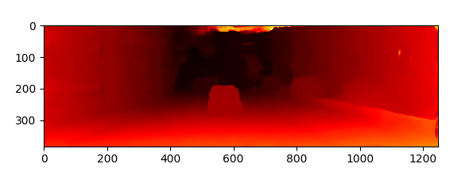
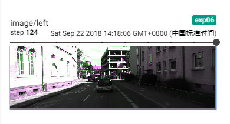

# PSM-Net

Pytorch reimplementation of PSM-Net: "[Pyramid Stereo Matching Network](https://arxiv.org/abs/1803.08669)" paper (CVPR 2018) by Jia-Ren Chang and Yong-Sheng Chen.

Official code: [JiaRenChang/PSMNet](JiaRenChang/PSMNet)


## Usage

### 1) Requirements

- Python3.5+
- Pytorch0.4
- Opencv-Python
- Matplotlib
- TensorboardX
- Tensorboard

All dependencies are in `requirements.txt`, you can follow below command to install dependencies.

``` shell
pip install requirements.txt
```

### 2) Train

``` shell
usage: train.py [-h] [--maxdisp MAXDISP] [--logdir LOGDIR] [--datadir DATADIR]
                [--cuda CUDA] [--batch-size BATCH_SIZE]
                [--validate-batch-size VALIDATE_BATCH_SIZE]
                [--log-per-step LOG_PER_STEP]
                [--save-per-epoch SAVE_PER_EPOCH] [--model-dir MODEL_DIR]
                [--lr LR] [--num-epochs NUM_EPOCHS]
                [--num-workers NUM_WORKERS]

PSMNet

optional arguments:
  -h, --help            show this help message and exit
  --maxdisp MAXDISP     max diparity
  --logdir LOGDIR       log directory
  --datadir DATADIR     data directory
  --cuda CUDA           gpu number
  --batch-size BATCH_SIZE
                        batch size
  --validate-batch-size VALIDATE_BATCH_SIZE
                        batch size
  --log-per-step LOG_PER_STEP
                        log per step
  --save-per-epoch SAVE_PER_EPOCH
                        save model per epoch
  --model-dir MODEL_DIR
                        directory where save model checkpoint
  --lr LR               learning rate
  --num-epochs NUM_EPOCHS
                        number of training epochs
  --num-workers NUM_WORKERS
                        num workers in loading data
```

For example:

``` shell
python train.py --batch-size 16 --logdir log/exmaple
```

### 3) Virsualize result

This repository use tensorboardX to virsualize training result. Find your log directory and launch tensorboard to look over the result. The default log directory is `/log`

``` shell
tensorboard --logdir <your_log_dir>
```

Here are some of my training result (not pretty good yet, just training for 100+ epochs):






## Task List

- [x] Train
- [ ] Test
- [x] KITTI2015 dataset
- [ ] Scene Flow dataset
- [x] Virsualize
- [ ] Pretained model

## Contact

Email: checkdeng0903@gmail.com

Wellcome for any discussions! 

